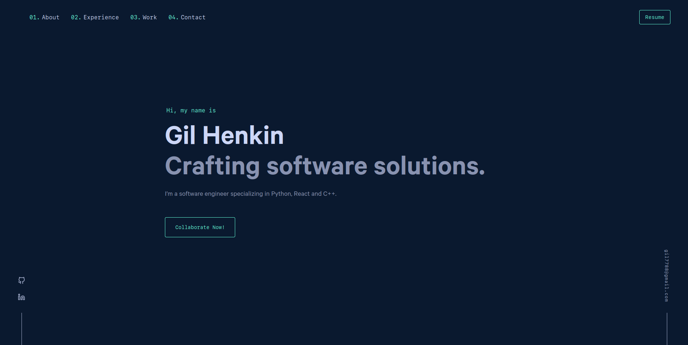

# Portfolio Website

A showcase of my software development projects and skills. This site is designed for potential employers, collaborators, and others interested in my work.



## Technologies Used

- React JS
- Gatsby
- Yarn
- HTML
- CSS

## Getting Started

1. Clone the repository:
```
git clone https://github.com/your-github-username/portfolio-website.git
```

2. Navigate to the project directory:
```
cd portfolio-website
```
    
3. Install dependencies using Yarn:
```
yarn install
```

4. Start the development server:
```
yarn start
```

5. Open [http://localhost:8000](http://localhost:8000) to view it in the browser.

## Available Scripts

### yarn start
Runs the app in the development mode. The page will reload if you make edits. You will also see any lint errors in the console.
```
yarn build
```

Builds the app for production to the public folder using Gatsby. It correctly bundles React in production mode and optimizes the build for the best performance.
```
yarn test
```

Launches the test runner in the interactive watch mode.

## License
This project is licensed under the MIT License.

## Learn More
- **React JS**: [React documentation](https://reactjs.org/)
- **Gatsby**: [Gatsby documentation](https://www.gatsbyjs.com/docs/)
- **Yarn**: [Yarn documentation](https://yarnpkg.com/)
- **Create React App**: [Create React App documentation](https://facebook.github.io/create-react-app/docs/getting-started)
